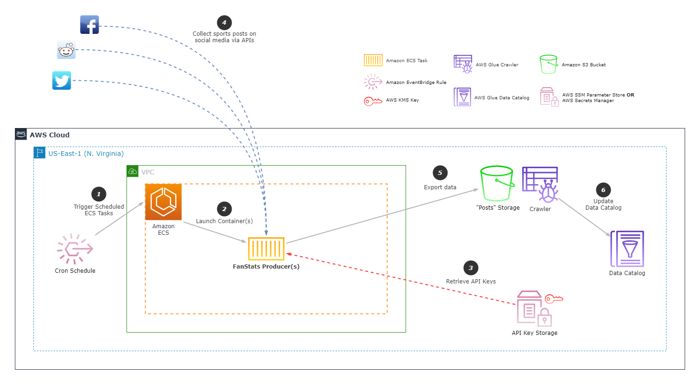

# FanStats Data Producer
The FanStats Producer is the first component of the FanStats project. It crawls for the latest posts, tweets, content, etc. from social media platforms and exports it to S3 for further ETL processing.

It runs as a Docker container on the [Amazon ECS](https://aws.amazon.com/ecs/) platform. More specifically, it is configured to run on [AWS Fargate](https://aws.amazon.com/fargate/), meaning that AWS automatically handles the provisioning of the underlying compute resources needed to host the container. The containers themselves are launched on a pre-set schedule via an [Amazon EventBridge](https://aws.amazon.com/eventbridge/) rule.

## Architecture Diagram

## Notes
- The producer code is in [`src/main.py`](src/main.py).
- Only Twitter is supported currently.
